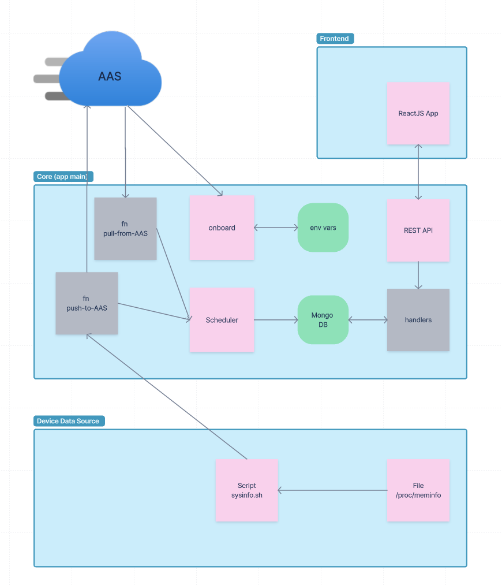

# Edge Device Management Backend Service

## Architecture 




### Onboarding Module
When the backend (Rust application) starts, onboarding function pull information from AAS server using device AssetID (read from env vars). After that, 
the initial state of the device is synchronized with AAS servers.

### Scheduler Module

This module implement a timer loop, which call registered functions peirodically. These fucntions pull and push data to AAS servers to keeps 
device state synchronized. Device information is kept in a local database.

### Rest API Module
The Rest API provide interface to the frontend. Rest API endpoints and logic are implemented in various "handlers".

REST Endpoint:

/submodels/{Submodel-Short-ID}

Submodel-Short-ID: SystemInformation, NetworkConfiguration, ManagedDevice, Nameplate

GET: Retrieve the current of submodel from the database

PATCH: Update the new value for the submodel to the database


## Rust Source Code

```bash
src/
├── config.rs
├── db.rs
├── error.rs
├── functions
│   ├── aas_interfaces.rs <- functions relate to aas and database 
│   ├── bash_command.rs <- function to run the bash script in Rust
│   ├── mod.rs 
│   ├── onboarding.rs <- functions for onboarding edge client
│   └── scheduler_task.rs <- pushing, polling functions and the scheduler
├── handlers <- method handlers
│   ├── home.rs
│   ├── mod.rs
│   ├── openapi.rs
│   ├── picture.rs
│   └── submodels.rs
├── main.rs
├── models
│   └── mod.rs
├── routes.rs <- endpoints
├── state
│   └── mod.rs
└── utils.rs

```


### Initialize EdgeClient:

In main.rs:

* Collect information from the environment variables (aas_client.env). (If missing, raise an error and exit.)

* Initialize MongoDB database with information from the environment. Then, wrap collections to share between threads.

* Run a loop until the device finishes onboarding. While onboarding, these action are done

* Collect shell information from the server

* Start a Thread for interval polling from AAS Server and pushing device data to AAS Server

* Start EdgeClient-Server and expose to port 18000.

### 1st time Onboarding (Startup EdgeClient container)

* Collect the shell information (all submodels_id) under endpoint {AAS_SERVER}/shells/{base64_of_aas_uid}

* Collect submodels information

* Collect the every single submodel under endpoint {AAS_SERVER}/shells/{base64_of_aas_uid}/submodels/{base64_of_submodel_uid}

* Store the submodel in the database

* Collect the thumbnail image of the device and store it in the specified folder

* Sending onboarding status to the server

### Scheduling + On/Offboarding
1. Polling
Fetching multiple submodels from the AAS Server (now only ManagedDevice) and save it to the database

2. Pushing
Collect information in the Edge device (example: System Information) then store new value to the database

```
Read the onboarding_status of the device:

  if the device is “OFFBOARDING_REQUESTED” → 

    Set onboarding_status to “OFFBOARD”

    SystemInformation will not be send to the AAS Server

  if the device is “OFFBOARDED” 

    If not reach the maximum of offboarding_time → do nothing

  if reach the maximum of offboading_time → set onboarding_status back to “ONBOARDED” and send data to AAS Server

  if the device is “ONBOARDED”

    Send the data to AAS Server
```