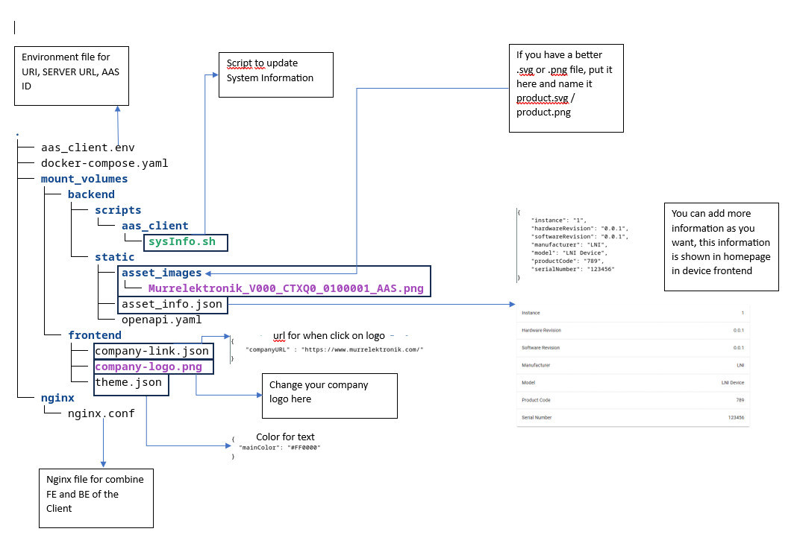

# Docker Deployment with Docker Compose




## Sample Demo Deployment with Published Container Images

Folder "dist-docker-compose" contain docker-compose file and folders to be mounted as volumes to backend and frontend containers. 
The mount folders allow customizing frontend view and backend scripts, which is run by backend service to collect device data. 
These folders are showed in the figure above. When deployed on an edge device, these files must be adapted to the device specific 
information.

```bash
# wsl
# get vm ip
ip a
# run docker-compose
cd dist-docker-compose
docker-compose up
```

url: http://wsl_ip:8081/


## Docker Deployment During Development

If the docker-compose at the root folder is used for deployment, the backend and frontend contaiers will be built directly from 
the source code in backend and frontend folders. The customization files (script, logos, etc) in the respective folders are used.

```bash
# wsl
docker-compose up
```

url: http://wsl_ip:8081/
